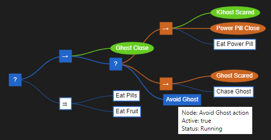

# Behavior Tree

A simple implementation of a behavior tree with a demo that can be
played with [here](http://0xABAD.github.io/behavior_tree).

[](https://github.com/jan-dolejsi/behavior_tree/actions?query=workflow%3ACI)
[](https://www.npmjs.com/package/behavior_tree_service)

## Introduction

Behavior trees are a technique used in video games and robotics to
model behavior AI.  Their use has become increasingly popular due to
their simple implementation, ease of understanding, and flexibility.
This README won't go into all the detail here but a cursory web search
will provide a plethora of information.

This project provides a simple demo to load and interact with a
behavior tree.  The values of conditions and actions can be switched
in the sidebar that is accessed from the top left menu of the demo.
The displayed tree can be panned, zoomed, and stretched both
horizontally and vertically.  The instructions for these interactions
can be accessed from '?' button in the top right of the demo.

As one interacts with the tree by toggling conditons and actions the
implementation will show the paths of the tree that have been explored
by filling in the explored nodes in a solid color.  Note that an
action or condition may be repeated within different parts of the tree
but an action or condition may be displayed with a solid color while
the exact same action or condition in another branch of the tree is
displayed only with an outline of the same color.  This illustrates
that the implementation does not explore the entire tree depending on
the organization of nodes and values of actions and conditions -- it
only seeks the most successful or running branch.

That last sentence mentions _successful_ and _running_, and that is
because a node may be one of three states:  _success_, _running_,
_failed_, and these states are denoted by the colors _green_, _blue_,
and _red_, respectively.  Note that condition nodes may be in a
_successful_ or _failed_ state, never _running_.



## Syntax

The demo allows the loading of any arbitrary tree and the syntax is
simple and easy to understand.  By default when the demo is loaded in
the browser the default tree for the behavior of Pac-man would be
written as:

```tree
?
|    ->
|    |    (Ghost Close)
|    |    ?
|    |    |    ->
|    |    |    |    !(Ghost Scared)
|    |    |    |    (Power Pill Close)
|    |    |    |    [Eat Power Pill]
|    |    |    ->
|    |    |    |    (Ghost Scared)
|    |    |    |    [Chase Ghost]
|    |    |    [Avoid Ghost]
|    =1
|    |    [Eat Pills]
|    |    [Eat Fruit]
```

The complete syntax will be discussed here.  There is a limited form
of error reporting as the parser will stop at the first error which
will then be displayed directly on the page with the line number that
it occurred on.  A correct tree must have exactly one root node.

### Fallback Node

A fallback node is written with a question mark, `?`, and will choose
the first child that evaluates to _success_ or _running_.  If all
children nodes have _failed_ then the fallback node will be _failed_
as well.  Fallback nodes resemble an *OR* operator of programming
languages with short-circuite behavior.

### Condition Node

A condition node is represented as `(name of condition)`.  A condition
represents a true or false state and as previously mentioned it may
never be in a running state.  Conditions form the backbone of a
behavior tree and are the key ingredient to influence its path to find
the current running behavior.  For the sake of this implementation
conditions are case sensitive when determining the state of a condition.

### Indentation Level

Indentation of a tree is marked with the `|` symbol and denotes one
level of indentation within the tree.  Multiple indentation markers
can be placed one after the other to increase the level of indentation
and thus increase the height of the tree.

With fallback and condition nodes along with indentation markers we
now have enough syntax to create a simple behavior tree.  Here we have
a tree with a height of one, has one fallback node, and two condition

```tree
?
|    (Condition One)
|    (Condition Two)
```

In this example, `(Condition One)` and `(Condition Two)` are child
nodes of the fallback node which will be in a _success_ state when
either of the children are in a _success_ state.

### Action Node

`[Some Action]` is the syntax for an action node.  Action nodes
specify _what_ should be done _when_ the action becomes active.  When
writing a tree, nodes are organized in order to have action nodes
becomes active so they can be _executed_ to carry the behavior of the
tree.  The component executing the action will report back whether the
action is _running_, _success_, or _failed_.

### Sequence Node

A sequence node is written with `->` and is in a _success_ state when
all of its children nodes are in a _success_ state.  Otherwise, the
state of the sequence node will be the state of the first child, whether
_failed_ or _running_.  A sequence node is akin to the *AND* operator
of many programming languages.

### Not Decorator

A condition node, and only condition nodes, may be decorated with the
not, `!`, decorator.  As is many programming languages this decorator
inverts the result of its condition, so `!(Have Free Space)` will be
in a _failed_ state when there is actually free space available.

### Parallel Node

The parallel node is written as `=N` where `N` is some positive
integer.  The parallel node, like fallback and sequence nodes, can
have an arbitrary number of children and is in a _success_ state when
the number of children in a _success_ state is greater than or equal
to `N`.  If number of children in a _failed_ state is greater than the
number of children in a _success_ state minus `N` then the parallel
node will be _failed_; otherwise, it will be considered _running_.

### Comments

The syntax also allows for comments in the tree model. Comment is
text that follows `;;`.

```tree
;; Header comment
->
|   (condition x) ;; trailing comment...
```

## Using BehaviorTree in your code

### Parsing behavior tree and executing it

The `BehaviorTree` may be used programmatically to execute the behavior modeled in the tree:

```javascript
const { BehaviorTree,
    Fallback, Sequence, Parallel, Action, Condition,
    FALLBACK, SEQUENCE, PARALLEL, ACTION, CONDITION,
    fallback, sequence, parallel, action, condition,
    SUCCESS, FAILED, RUNNING, FINISHED,
    SAMPLE_TREE, getFriendlyStatus } = require('../btree');
```

```javascript
let tree = BehaviorTree.fromText(`
?
|   !(have hunger)
|   [eat]`);

// subscribe to action activation
tree.onActionActivation(actionNode => {
    switch (actionNode.name) {
        case 'eat':
            console.log(getFriendlyStatus(actionNode.status())); // prints 'running'
            if (actionNode.active()) { // in general we should check that the action is in an active branch
                console.log('Started eating...');
                // no longer hungry!
                tree.setConditionStatus('have hunger', FAILED);
                console.log('Done eating...');
                tree.setActionStatus('eat', SUCCESS);
            }
    }
});
tree.root.tick();

console.log('Initial state:');
console.log(getFriendlyStatus(tree.root.status())); // prints 'success'
console.log(tree.root.active()); // prints true

// then we get hunger
tree.setConditionStatus('have hunger', SUCCESS);
let statusAfterHungerIsTrue = tree.root.tick();
console.log(getFriendlyStatus(statusAfterHungerIsTrue)); // prints 'success', because the action was executed synchronously as part of the tick

// now 'Started/Done eating...' should be printed

// final state:
tree.root.tick();
console.log(getFriendlyStatus(tree.root.status())); // prints 'success'
```

This approach allows the separation between the tree model and the action implementation.

### Building behavior tree and executing it

Another way to use the `BehaviorTree` is to programmatically construct the tree nodes, including the action implementation:

```javascript
// define the action 'eat' implementation
let onEat = function (actionNode) {
    switch (actionNode.name) {
        case 'eat':
            console.log(getFriendlyStatus(actionNode.status())); // prints 'running'
            if (actionNode.active()) { // in general we should check that the action is in an active branch
                console.log('Started eating...');
                // no longer hungry!
                tree.setConditionStatus('have hunger', FAILED);
                console.log('Done eating...');
                tree.setActionStatus('eat', SUCCESS);
            }
    }
};

// ?
// |   !(have hunger)
// |   [eat]`

let rootNode = fallback([
    condition("have hunger", true),
    action("eat", onEat)
]);
let tree = new BehaviorTree(rootNode);
```

## Using BehaviorTree as a NPM package

Both the `BehaviorTree` library and the service are available via NPM.

### NPM library

```bash
npm install behavior_tree_service
```

```javascript@Ignore
const { BehaviorTree } = require('behavior_tree_service');
```

```javascript
let tree = BehaviorTree.fromText(`-->
|   (condition)
`);

console.log(tree);
```

### NPM service

```bash
npm install behavior_tree_service -g

behavior_tree_service --help
```

### In your web page

You can import the java script in your web page by importing it this way:

```html
<script defer src="https://unpkg.com/behavior_tree_service@latest/btree.js"></script>
<script defer src="https://unpkg.com/behavior_tree_service@latest/btreeviz.js"></script>
```

```javascript
const host = document.getElementById("tree-host");
const tree = BehaviorTree.fromText(`->
    |   [Action1]
    |   (Condition1)`);

function nodeDoubleClicked(node, shiftKey) {
    console.log(`Node ${node.name} double-clicked withe the shift key ${shiftKey ? "down" : "up"}`);
}

function nodeRightClicked(node) {
    console.log(`Node ${node.name} right-clicked`);
}


const treeRefresh = showTree(tree, host,  nodeDoubleClicked, nodeRightClicked);

// update a tree node
tree.setConditionStatus('Condition1', FAILED);
// re-paint the view
treeRefresh();
```
